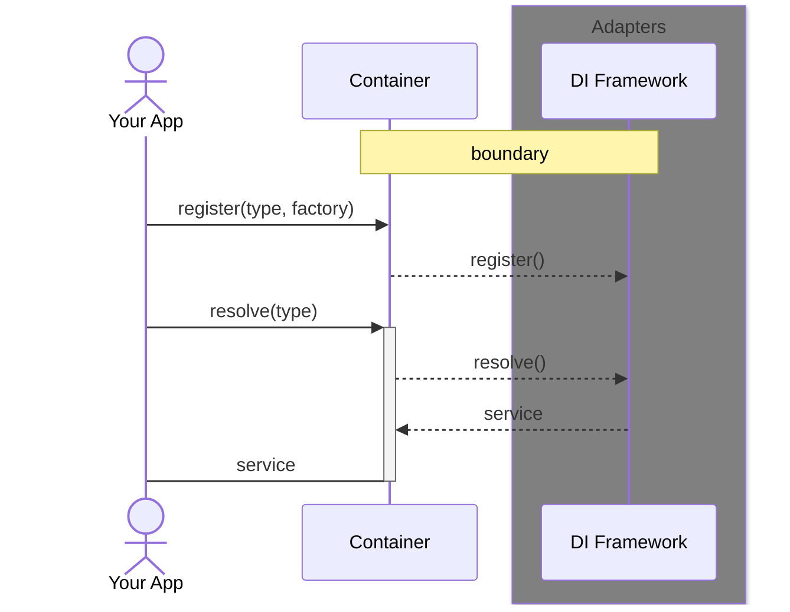

# Didi

[](https://swift.org)
[](https://www.swift.org/package-manager/)


`Didi` (pronounced _/diː diː/_ or _dee dee_) is a dependency injection abstracion layer, written with dependency inversion in mind.

It leverages powerful Swift features like _result builders_, _property wrappers_, _operators_ and _parameter packs_ to offer a robust, friendly and compile-time safe API.

> **Discalimer**
> 
> `Didi` is NOT a dependency injection framework

## Architecture




## Installation

### Swift Package Manager

Add `Didi` to your dependencies:

```swift
dependencies: [
    .package(url: "https://github.com/antoniopantaleo/Didi.git", branch: "develop")
]
```

Then depend on the products you need:

```swift
.target(
    name: "YourApp",
    dependencies: [
        .product(name: "Didi", package: "Didi")
    ]
)
```

## Quick start

Here's a brief look on how `Didi` API looks like:

### Registration

You can register a service to a type using the special `~>` syntax, listing all of your injections like this:

```swift
import Didi

let container: any Container = MyContainer()

container.register {
    HTTPClient.self ~> URLSessionHTTPClient(session: .shared) // You don't need to write commas 
    String.self ~> "Hello, Didi"
    // ...
}
```

Registration offers compile-time safety thanks to Swift's powerful generics system. 
Wrong registration like the following will be clearly reported by the compiler:

```swift
  container.register {
    Int.self ~> "hello didi" // ⛔️ Binary operator '~>' cannot be applied to operands of type 'Int.Type' and 'String'
  }
```

### Resolution

Once registered, a service can be safely resolved using the `@Injected` property wrapper:

```swift
@Injected(in: container) var greeting: String? // Or simply '@Injected' if you provide a default container
print(greeting ?? "Missing")
```

## Backends

`Didi` comes with a set of pre-implemented adapters (or backends) based on popular existing frameworks like:
- [Swinject](https://github.com/Swinject/Swinject#)
- [Factory](https://github.com/hmlongco/Factory)

## Contributing
Issues and pull requests are welcome. Feel free to contribute!
